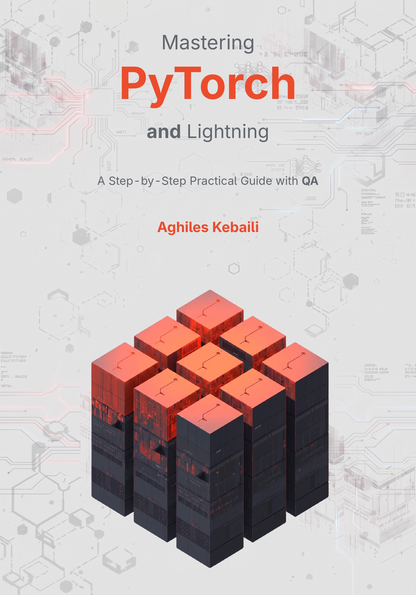

<div align="center">



# Mastering PyTorch and Lightning

### A Step-by-Step Practical Guide with QA

**Official companion code repository for the ebook by Aghiles Kebaili**

[](https://www.amazon.fr/Mastering-PyTorch-Lightning-Step-Step-ebook/dp/B0HGNZS55V)

</div>

---

## From PyTorch Foundations to Scalable Lightning Projects

Training a model is only the beginning. Reliable deep-learning systems also require understandable data movement, correct optimization, reproducible execution, meaningful logging, and a clear separation between model logic and infrastructure.

*Mastering PyTorch and Lightning* develops these skills progressively, from tensor internals and Autograd to production-ready data pipelines, distributed training, mixed precision, callbacks, checkpointing, and generative AI.

This repository accompanies the book with executable code designed to help you:

- reproduce the examples presented in each chapter
- inspect tensors, gradients, batches, metrics, and checkpoints directly
- move from isolated snippets to complete training workflows
- experiment with the examples without rewriting the projects from scratch
- verify your understanding through practical exercises and QA sections

> **Recommended workflow:** Keep this repository open while reading the hands-on chapters. Run the corresponding code alongside the explanations, inspect the intermediate results, and modify the examples to test your understanding.

## What the Book Covers

### Module 0: The Industrial Deep-Learning Landscape

Understand the PyTorch ecosystem, hardware acceleration, CUDA compatibility, development environments, and the role of Lightning in larger projects.

### Module 1: PyTorch Core Foundations

- tensor storage, shapes, strides, dtypes, and devices
- tensor mathematics and advanced indexing
- Autograd and computational graphs
- custom neural architectures with `torch.nn`

### Module 2: Data and Native Training Loops

- production-ready datasets and DataLoaders
- native training, validation, and evaluation loops
- hardware acceleration and model persistence
- a complete denoising autoencoder capstone project

### Module 3: PyTorch Lightning Enterprise Architecture

- refactoring native PyTorch code into a `LightningModule`
- reusable data pipelines with `LightningDataModule`
- Trainer configuration and lifecycle management
- callbacks, checkpointing, early stopping, and logging
- mixed precision and multi-GPU training
- denoising autoencoder and variational autoencoder capstone projects

## Companion Code Philosophy

The examples follow the same progression as the book. Each concept is introduced in a small, testable form before being integrated into a complete workflow.

The code emphasizes:

- explicit tensor and batch-shape checks
- reproducible dataset splits
- portable CPU and GPU execution
- separation between model, data, and execution logic
- validation before optimization or distributed scaling
- granular use of `torch.compile` on tensor-heavy components
- practical patterns that remain readable and maintainable

## Getting Started

Clone the repository and create an isolated Python environment:

```bash
git clone https://github.com/Arksyd96/mastering-pytorch-lightning-book.git
cd mastering-pytorch-lightning-book

python -m venv .venv
source .venv/bin/activate
```

On Windows:

```powershell
.venv\Scripts\activate
```

Install PyTorch using the command recommended for your operating system and accelerator by the official PyTorch installation selector. Then install the remaining learning tools:

```bash
pip install pytorch-lightning torchvision jupyterlab
jupyter lab
```

> PyTorch installation commands depend on your hardware and supported CUDA runtime. Avoid copying a CUDA-specific command without first checking your environment.

## Featured Practical Projects

### Native PyTorch Denoising Autoencoder

Build a complete image-denoising workflow with dynamic corruption, native optimization, validation, checkpointing, and reconstruction checks.

### Lightning Denoising Autoencoder

Refactor the native project into reusable `LightningModule` and `LightningDataModule` components while keeping model logic independent from execution policy.

### Variational Autoencoder

Implement latent parameterization, the reparameterization trick, reconstruction and KL losses, generative sampling, mixed precision, and optional granular compilation.

## Who This Repository Is For

This companion repository is intended for:

- students building a rigorous PyTorch foundation
- researchers turning experimental code into reusable projects
- engineers adopting PyTorch Lightning for structured training
- practitioners preparing workloads for accelerators and distributed execution
- readers who learn best by running, inspecting, and modifying real code

## About the Author

**Aghiles Kebaili** holds a PhD in Artificial Intelligence and specializes in deep learning, computer vision, and generative AI for medical imaging. His research and engineering experience includes representation learning, variational autoencoders, diffusion models, multimodal image synthesis, tumor segmentation, and predictive modeling from clinical data.

Drawing on more than six years of experience with PyTorch and PyTorch Lightning, he designed this book around clear architecture, reliable implementation patterns, testability, reproducibility, and scalable training.

- Portfolio: [arksyd96.github.io](https://arksyd96.github.io)
- Google Scholar: [Publication profile](https://scholar.google.com/citations?user=Sp3Q6LQAAAAJ)

## Get the Ebook

The companion code is most useful when followed alongside the explanations, diagrams, gotchas, checkpoints, and QA sections in the complete ebook.

**[View the ebook on Amazon](https://www.amazon.fr/Mastering-PyTorch-Lightning-Step-Step-ebook/dp/B0HGNZS55V)**

The Amazon URL is currently a placeholder and should be replaced when the product page becomes available.

## Feedback and Contributions

If you find an issue in an example or have a suggestion that improves the learning experience, open an issue with the relevant chapter, environment details, and a minimal reproduction when possible.

---

<div align="center">

**Build the foundations. Understand the mechanics. Scale with confidence.**

</div>
